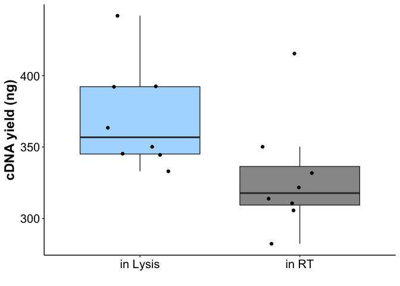
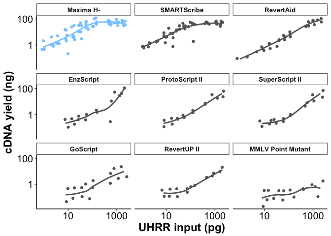
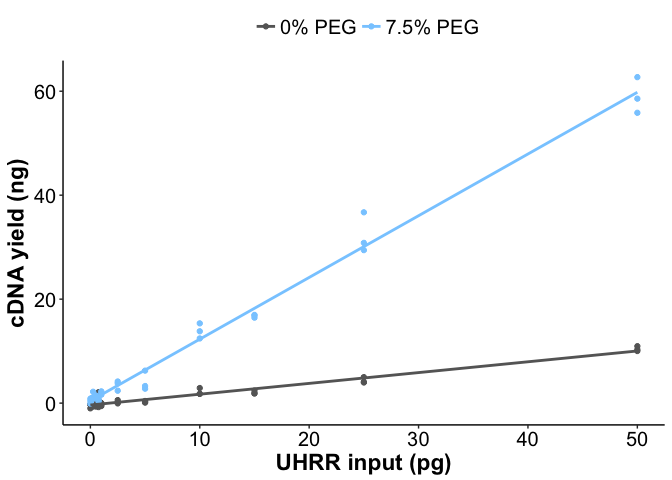

Figure 2: Reverse Transcription
================

Use this code to reproduce Figure 2 from Bagnoli et al., 2017.

Step 1: load required packages & functions:

``` r
# Load Packages & Functions -----------------------------------------------
pckgs <- c("here","ggplot2","dplyr","cowplot")
lapply(pckgs, function(x) suppressMessages(require(x, character.only = TRUE)))
```

    ## [[1]]
    ## [1] TRUE
    ## 
    ## [[2]]
    ## [1] TRUE
    ## 
    ## [[3]]
    ## [1] TRUE
    ## 
    ## [[4]]
    ## [1] TRUE

``` r
SCRB_col <- "#4CAF50"
SMURF_col <- "#88CCFF"
theme_pub <- theme_classic() + theme(axis.text = element_text(colour="black", size=15), 
                                     axis.title=element_text(size=17,face="bold"), 
                                     legend.text=element_text(size=15),
                                     legend.position="top",
                                     legend.key=element_blank(),
                                     legend.justification="center", 
                                     axis.line.x = element_line(colour = "black"), 
                                     axis.line.y = element_line(colour = "black"),
                                     strip.background=element_blank(), 
                                     strip.text=element_text(size=17)) 

path_to_data <- here::here()
```

Step 2: load data

``` r
olidt_opt<- read.table(paste(path_to_data,"Data/oligodt_optimisation.txt",sep="/"), header = T, sep="\t")
RT_enzymes<- read.table(paste(path_to_data,"Data/RT_Enzymes.txt",sep="/"), header = T, sep="\t") 
PEG_sens<- read.table(paste(path_to_data,"Data/PEG_sensitivity.txt",sep="/"), header = T, sep="\t")
```

Step 3: Plot Panel A (cDNA yield dependent on oligo-dt Primer condition)

``` r
p_Fig2a<-ggplot()+
  geom_boxplot(data= olidt_opt, aes(x=condition, y=yield, fill=condition), alpha=0.7, outlier.shape = NA)+
  geom_jitter(data=olidt_opt, aes(x=condition, y=yield), width = 0.25)+
  scale_fill_manual(values=c(SMURF_col,"#666666"))+
  xlab("")+
  ylab("cDNA yield (ng)")+
  theme_pub+
  guides(fill=F)
p_Fig2a
```



Step 4: Plot Panel B (RT enzyme data)

``` r
RT_enzymes$log_yield<-RT_enzymes$yield+0.001 #add 0.001 to cDNA for logarithmic transforming in a new column

RT_enzymes$efficiency<-RT_enzymes$yield/RT_enzymes$input #add new column: calculate the efficiency in converting UHRR in first strand cDNA


RT_mean<- aggregate(RT_enzymes$efficiency, by = list(enzyme = RT_enzymes$enzyme), FUN = mean) #calculate mean efficiency per enzmye

RT_mean<-RT_mean[order(RT_mean$x, decreasing = T),] #order Data frame by efficiency

RT_enzymes$enzyme<-factor(RT_enzymes$enzyme, levels=RT_mean$enzyme) #reorder levels using the mean efficiency
p_Fig2b<-ggplot()+
  geom_jitter(data=RT_enzymes, aes(x=input*1000, y=log_yield, colour=enzyme))+
  facet_wrap(~enzyme)+
  theme_bw()+
  geom_smooth(data=RT_enzymes, aes(x=input*1000, y=log_yield, colour=enzyme), se=F, method="loess")+
  xlab("UHRR input (pg)")+
  ylab("cDNA yield (ng)")+
  theme(axis.text = element_text(face="bold", size=10), axis.title = element_text(face="bold", size=10))+
  guides(colour=F)+
  scale_y_log10() + scale_x_log10()+
  theme_pub+
  theme(strip.background =element_rect(fill="white"))+
  theme(strip.text = element_text(face="bold", size=10))+
  scale_color_manual(values=c(SMURF_col, "#666666","#666666","#666666","#666666","#666666","#666666","#666666","#666666"))
p_Fig2b
```



Step 5: Plot Panel C (cDNA yield vs UHRR input)

``` r
p_Fig2c<-ggplot()+
  geom_point(data=PEG_sens, aes(x=input, y=yield, colour=PEG))+
  stat_smooth(data=PEG_sens, aes(x=input, y=yield, colour=PEG), se=F, method = lm)+
  xlab("UHRR input (ng)")+
  ylab("cDNA yield (ng)")+
  theme(axis.text = element_text(face="bold"), axis.title = element_text(face="bold"))+
  guides(colour=guide_legend(title=NULL))+
  scale_color_manual(values=c("#666666", SMURF_col))+
  theme_pub
p_Fig2c
```



Step 6: Save final plot

``` r
p_Fig2 <- plot_grid(plot_grid(p_Fig2a,p_Fig2c,ncol=1, labels=c("A", "C")),p_Fig2b,ncol=2, labels = c("", "B"))
ggsave(p_Fig2,filename = paste(path_to_data,"PDF_output","Figure2.pdf",sep="/"),device="pdf",width = 12,height = 8)
```
