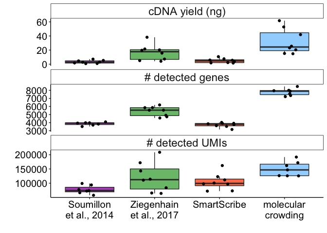
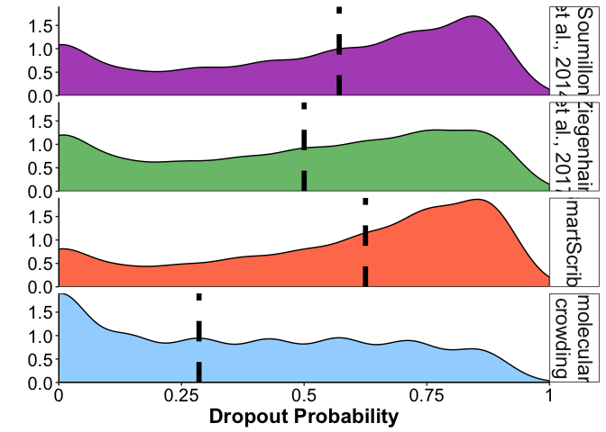

Figure 3: UHRR sequencing
================

Use this code to reproduce Figure 3 from Bagnoli et al., 2017.

Step 1: load required packages & functions:

``` r
# Load Packages & Functions -----------------------------------------------
pckgs <- c("here","ggplot2","dplyr","tidyr","tidyselect","cowplot")
lapply(pckgs, function(x) suppressMessages(require(x, character.only = TRUE)))
```

    ## [[1]]
    ## [1] TRUE
    ## 
    ## [[2]]
    ## [1] TRUE
    ## 
    ## [[3]]
    ## [1] TRUE
    ## 
    ## [[4]]
    ## [1] TRUE
    ## 
    ## [[5]]
    ## [1] TRUE
    ## 
    ## [[6]]
    ## [1] TRUE

``` r
SCRB_col <- "#4CAF50"
SMURF_col <- "#88CCFF"
theme_pub <- theme_classic() + theme(axis.text = element_text(colour="black", size=15), 
                                     axis.title=element_text(size=17,face="bold"), 
                                     legend.text=element_text(size=15),
                                     legend.position="top",
                                     legend.key=element_blank(),
                                     legend.justification="center", 
                                     axis.line.x = element_line(colour = "black"), 
                                     axis.line.y = element_line(colour = "black"),
                                     strip.background=element_blank(), 
                                     strip.text=element_text(size=17)) 
generate_stats <- function(exprdf,conds){
  require(matrixStats)
  if(length(conds)!=ncol(exprdf)){
    print("Erorr in Conditions given")
    stop()
  }
  conds_vec <- unique(conds)
  cvfrommatrix <- function(exprmatrix){
    exprtmp <- as.matrix(exprmatrix)
    cv <- (matrixStats::rowSds(exprtmp)/rowMeans(exprtmp))
    return(cv)
  }
  calcp0 <- function(exprtable){
    nsamples = dim(exprtable)[2]
    nn0 = rowSums(!exprtable)
    p0 = 1 - ((nsamples - nn0)/nsamples)
    return(p0)
  }
  output_df_collect <- data.frame(GeneID=NA,mu=NA,cv=NA,p0=NA,cond=NA,stringsAsFactors = F)
  for(i in conds_vec){
    tmp_expr <- exprdf[,grep(i,conds)]
    tmp_expr <- tmp_expr[which(rowSums(tmp_expr)>0),]
    output_df_tmp <- data.frame(GeneID=row.names(tmp_expr),
                                mu=rowMeans(tmp_expr),
                                cv=cvfrommatrix(tmp_expr),
                                p0=calcp0(tmp_expr),
                                cond=rep(i,nrow(tmp_expr)),
                                stringsAsFactors = F)
    output_df_collect <- rbind.data.frame(output_df_collect,output_df_tmp) 
  }
  output_df_collect <- output_df_collect[-1,]
  output_df_collect$EPV <- output_df_collect$cv - (sqrt(output_df_collect$mu)/output_df_collect$mu)
  output_df_collect$poisson_cv <- (sqrt(output_df_collect$mu)/output_df_collect$mu)
  return(output_df_collect)
}
path_to_data <- here::here()
```

Step 2: load data

``` r
UHRR_counts <- read.table(paste(path_to_data,"Data/UHRR_UMIcounts_1mio.txt",sep="/"), header=T, row.names = 1, sep="\t") #import count matrix
UHRR_cDNA <- read.table(paste(path_to_data,"Data/UHRR_cDNA.txt",sep="/"), header=T, sep="\t") #import cDNA measurements
bc <- read.table(paste(path_to_data,"Data/barcodes_UHRR.txt",sep="/"), sep = "\t", header = T, stringsAsFactors = F)# Import barcode annotations
```

Step 3: Calculate Number of Genes, UMIs, etc

``` r
UHRR_counts_df<- data.frame(XC=colnames(UHRR_counts), NUM_GENES=colSums(UHRR_counts>1),NUM_UMI=colSums(UHRR_counts)) #combine Number of UMIs and genes per sample barcode

UHRR_df<- dplyr::full_join(UHRR_counts_df, UHRR_cDNA, by="XC") # Combine sequencing data with cDNA measurements

UHRR_df<- dplyr::left_join(UHRR_df, bc, by=c("XC", "Pap_name")) # Combine data and annotation

options(scipen=999) #prevent scientific notation

UHRR_df_long<- tidyr::gather(UHRR_df, type, measurement, 2:4) #Convert to long format


#replace type names
UHRR_df_long$type <- replace(UHRR_df_long$type, UHRR_df_long$type=="NUM_GENES", "# detected genes")
UHRR_df_long$type <- replace(UHRR_df_long$type, UHRR_df_long$type=="NUM_UMI", "# detected UMIs")
UHRR_df_long$type <- replace(UHRR_df_long$type, UHRR_df_long$type=="yield", "cDNA yield (ng)")

#relevel type
UHRR_df_long$type<- factor(UHRR_df_long$type, levels = c("cDNA yield (ng)","# detected genes","# detected UMIs"  ))
UHRR_df_long$Pap_name<- factor(UHRR_df_long$Pap_name, levels = c("Soumillon","Ziegenhain","SmartScribe", "molecular\ncrowding" ))
```

Step 4: Plot Panels A-C:

``` r
p_Fig3abc<-ggplot()+
  geom_boxplot(data=UHRR_df_long, aes(x=Pap_name, y=measurement, fill=Pap_name),alpha=0.8, outlier.shape = NA)+
  geom_jitter(data=UHRR_df_long, aes(x=Pap_name, y=measurement), width=0.25)+
  facet_wrap(~type, scales = "free_y", ncol = 1)+
  xlab("")+
  ylab("")+
  theme_bw()+
  scale_x_discrete(labels=c("Soumillon\net al., 2014","Ziegenhain\net al., 2017","SmartScribe","molecular\ncrowding"))+
  theme(axis.text = element_text(face="bold", colour = "black", size=10), axis.title = element_text(face="bold",colour = "black", size=10))+
  scale_fill_manual(values = c("#9d29b0","#50af51", "#ff5823","#88CCFF"))+
  guides(fill=F)+
  theme_pub+
  theme(strip.background =element_rect(fill="white"))
p_Fig3abc
```



Step 5: Calculate & Plot Dropout Rates:

``` r
UHRR_counts_filt<- UHRR_counts[rowMeans(UHRR_counts)>0.2,]

# Create a data frame with conditions for each barcode, ordered as colnames of count matrix
conds_df<- data.frame("XC"=colnames(UHRR_counts_filt))
conds_df<- dplyr::left_join(conds_df, bc[, c(1,3)], by ="XC")
```

    ## Warning: Column `XC` joining factor and character vector, coercing into
    ## character vector

``` r
# Create general stats for filtered count matrix
UHRR_stats<- generate_stats(exprdf = UHRR_counts_filt, conds = conds_df$Pap_name)
```

    ## Loading required package: matrixStats

    ## 
    ## Attaching package: 'matrixStats'

    ## The following object is masked from 'package:dplyr':
    ## 
    ##     count

``` r
# Replace conditions for plotting
UHRR_stats$cond <- replace(UHRR_stats$cond, UHRR_stats$cond=="Ziegenhain", "Ziegenhain\net al., 2017")
UHRR_stats$cond <- replace(UHRR_stats$cond, UHRR_stats$cond=="Soumillon", "Soumillon\net al., 2014")

# Relevel conditions for plotting
UHRR_stats$cond<- factor(UHRR_stats$cond,levels=c("Soumillon\net al., 2014","Ziegenhain\net al., 2017","SmartScribe","molecular\ncrowding"))

# calculate median of dropuot probability(p0) for each method
drop_median<- aggregate(UHRR_stats$p0, by = list(cond=UHRR_stats$cond), FUN=median)


# Plot dropout probability (p0)
p_Fig3d<-ggplot()+
  geom_density(data=UHRR_stats, aes(p0, fill=cond), stat = "density", adjust = 1.5, alpha=0.8)+
  geom_vline(data=drop_median, aes(xintercept = x), size=2, linetype="dashed")+
  facet_wrap(~cond,ncol = 1,strip.position = c("right")) +
  scale_x_continuous(expand=c(0,0),breaks = c(0.00, 0.25,0.5,0.75, 1),labels = c(0, 0.25,0.5,0.75, 1)) +
  ylab("")+
  xlab("Dropout Probability")+
  theme(axis.text = element_text(face="bold", colour = "black", size=10), axis.title = element_text(face="bold",colour = "black", size=10))+
  scale_fill_manual(values = c("#9d29b0","#50af51", "#ff5823","#88CCFF"))+
  guides(fill=F)+
  theme_pub+
  theme(strip.background =element_rect(fill="white"))+
  scale_y_continuous(expand = c(0, 0))+ expand_limits(x=c(0,1))
p_Fig3d
```



Step 6: Save final plot

``` r
p_Fig3<- ggdraw()+
  draw_plot(p_Fig3abc,x=0,y=0,width =0.5 ,height =1 )+
  draw_plot(p_Fig3d,x=0.5,y=0,width = 0.5,height =1 )+
  draw_plot_label(c("A", "B", "C", "D"), c(0,0,0,0.5), c(1,0.69,0.38,1))
ggsave(p_Fig3,filename = paste(path_to_data,"PDF_output","Figure3.pdf",sep="/"),device="pdf",width = 14,height = 10)
```
