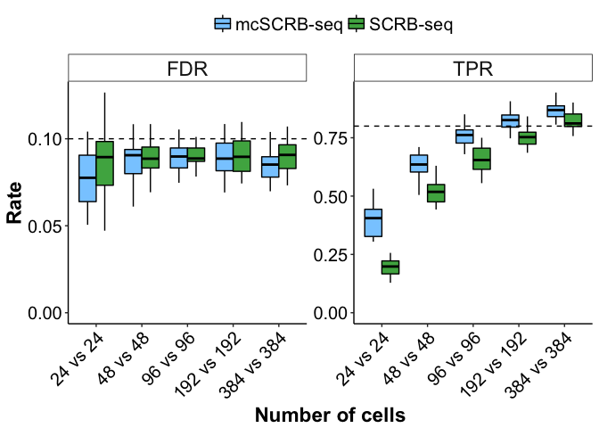

Figure 6: powsimR
================

Use this code to reproduce Figure 6 from Bagnoli et al., 2017.

Step 1: load required packages & functions:

``` r
# Load Packages & Functions -----------------------------------------------
pckgs <- c("here","ggplot2","dplyr","cowplot","powsimRDev")
lapply(pckgs, function(x) suppressMessages(require(x, character.only = TRUE)))
```

    ## [[1]]
    ## [1] TRUE
    ## 
    ## [[2]]
    ## [1] TRUE
    ## 
    ## [[3]]
    ## [1] TRUE
    ## 
    ## [[4]]
    ## [1] TRUE
    ## 
    ## [[5]]
    ## [1] TRUE

``` r
SCRB_col <- "#4CAF50"
SMURF_col <- "#88CCFF"
theme_pub <- theme_classic() + theme(axis.text = element_text(colour="black", size=15), 
                                     axis.title=element_text(size=17,face="bold"), 
                                     legend.text=element_text(size=15),
                                     legend.position="top",
                                     legend.key=element_blank(),
                                     legend.justification="center", 
                                     axis.line.x = element_line(colour = "black"), 
                                     axis.line.y = element_line(colour = "black"),
                                     strip.background=element_blank(), 
                                     strip.text=element_text(size=17)) 

whichgenes_reproducible <- function(exprtable,exprcutoff,reproducecutoff){
  expressedgenes <- row.names(exprtable[which(rowSums(exprtable)>=exprcutoff),])
  tmp <- exprtable[expressedgenes,]
  ndetections <- rowSums(exprtable[expressedgenes,]>=1)
  outgenes <- names(ndetections[which(ndetections/ncol(exprtable)>=reproducecutoff)])
  return(outgenes)
}

path_to_data <- here::here()
```

Step 2: load data

``` r
JM8 <- readRDS(paste(path_to_data,"Data/JM8.rds",sep="/"))
JM8_barcodeinfo <- read.table(paste(path_to_data,"Data/barcodes_QCfilter.txt",sep="/"), header=T, sep="\t",stringsAsFactors = F)
```

Step 3: Set up Simulations

``` r
reps <- c(24,48,96,192,384)

#draw 45 cells per method for parameter estimation, that reached at least 1 mio reads
SCRB_cells <- sample(JM8_barcodeinfo[which(JM8_barcodeinfo$rpc>1000000 & JM8_barcodeinfo$QCpass==TRUE & JM8_barcodeinfo$method=="SCRB"),"XC"],size = 45,replace = F)
mcSCRB_cells <- sample(JM8_barcodeinfo[which(JM8_barcodeinfo$rpc>1000000 & JM8_barcodeinfo$QCpass==TRUE & JM8_barcodeinfo$method=="SMURF"),"XC"],size = 45,replace = F)

#get a reproducible geneset (at least 10 detections per method)
SCRB_genes <- whichgenes_reproducible(JM8$downsampled$downsampled_1000000$umicounts_downsampled[,SCRB_cells],1,0.22)#equals to detection in 10 cells
mcSCRB_genes <- whichgenes_reproducible(JM8$downsampled$downsampled_1000000$umicounts_downsampled[,mcSCRB_cells],1,0.22)#equals to detection in 10 cells

#this is our simulation geneset
powsim_geneset <- union(SCRB_genes,mcSCRB_genes)

#Estimate empirical parameters for simulation
SCRB_estparam <- estimateParam(JM8$downsampled$downsampled_500000[[1]][powsim_geneset,SCRB_cells],RNAseq = "singlecell",Distribution = "NB",normalisation = "scran")
mcSCRB_estparam <- estimateParam(JM8$downsampled$downsampled_500000[[1]][powsim_geneset,mcSCRB_cells],RNAseq = "singlecell",Distribution = "NB",normalisation = "scran")

#define a log-foldchange distribution
lfc.foo <- function(x) rnorm(x, sd = 1.5)

#define differential expression parameters
DEsets <- DESetup(ngenes = length(powsim_geneset),nsims=25,pLFC=lfc.foo,sim.seed = 1234,p.DE = 0.1)

#Setup simulation with parameters and DE settings
SCRB.sim.set <- SimSetup(DEsets,SCRB_estparam,size.factors = "given")
mcSCRB.sim.set <- SimSetup(DEsets,mcSCRB_estparam,size.factors = "given")
```

Step 4: Run powsimR simulations note: Simulations will take a while, depending on the computer. To save time for this markdown, I provide and load the simulation output instead.

``` r
#SCRB.sim.out <- simulateDE(n1=reps,n2=reps,sim.settings = SCRB.sim.set,DEmethod = "ROTS",normalisation="scran")
#mcSCRB.sim.out <- simulateDE(n1=reps,n2=reps,sim.settings = mcSCRB.sim.set,DEmethod = "ROTS",normalisation="scran")

SCRB.sim.out <- readRDS(paste(path_to_data,"Data/powsimR_SCRBseq.rds",sep="/"))
mcSCRB.sim.out <- readRDS(paste(path_to_data,"Data/powsimR_mcSCRBseq.rds",sep="/"))
```

Step 5: Evaluate simulation output

``` r
SCRB.eval <- evaluateDE(SCRB.sim.out,alpha.type = "adjusted",MTC="BH")
mcSCRB.eval <- evaluateDE(mcSCRB.sim.out,alpha.type = "adjusted",MTC="BH")
```

Step 6: Generate plot

``` r
powsim_df <- rbind(reshape2::melt(mcSCRB.eval$TPR.marginal),reshape2::melt(SCRB.eval$TPR.marginal),
                   reshape2::melt(mcSCRB.eval$FDR.marginal),reshape2::melt(SCRB.eval$FDR.marginal))
#annotate data frame
powsim_df$method <- rep(c(rep("mcSCRB-seq",125),rep("SCRB-seq",125)),2)  
powsim_df$type <- c(rep("TPR",250),rep("FDR",250))

#temporary dataframe for nominal TPR and FDR line plotting
line_df <- data.frame(y=c(0.1,0.8),type=c("FDR","TPR"))

p_pow <- ggplot(powsim_df,aes(x=Var1,y=value,fill=method, group=interaction(method,Var1))) + 
  geom_boxplot(color="black",outlier.shape = NA) + theme_pub + 
  scale_fill_manual(values=c(SMURF_col,SCRB_col)) + 
  facet_wrap(~type,scales = "free") + 
  scale_x_continuous(breaks=1:5,labels=paste(reps," vs ",reps,sep="")) + 
  theme(strip.background = element_rect(color="black"),axis.text.x = element_text(angle=45,vjust = 1,hjust=1), legend.title = element_text(size=0))+
  xlab("Number of cells") + ylab("Rate") + geom_hline(data=line_df,aes(yintercept=y), linetype="dashed") + geom_blank(aes(y=0))
p_pow
```



Step 7: save plot

``` r
ggsave(p_pow,filename = paste(path_to_data,"PDF_output","Figure6.pdf",sep="/"),device="pdf",width = 8,height = 6)
```
